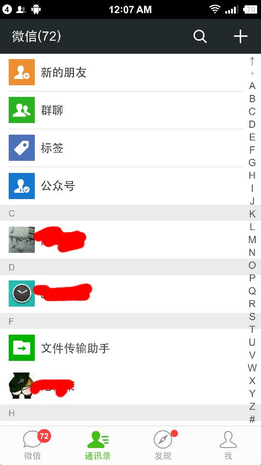
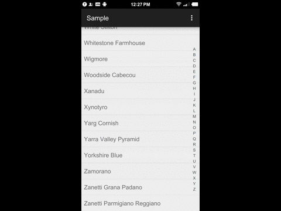

# IndexBar
========

### 描述
仿微信通讯录索引条

### 微信通讯录截屏


### Demo


### 整合到程序

**1)** 添加IndexBar到你的布局文件中。

    <ListView
        android:id="@android:id/list"
        android:layout_width="match_parent"
        android:layout_height="match_parent" />

    <TextView
        android:id="@+id/previewText"
        android:layout_width="wrap_content"
        android:layout_height="wrap_content"
        android:layout_centerInParent="true"
        android:textSize="40sp"
        android:textStyle="bold" />

    <com.droideep.indexbar.IndexBar
        android:id="@+id/index_bar"
        android:layout_width="wrap_content"
        android:layout_height="wrap_content"
        android:layout_alignParentRight="true"
        android:layout_centerVertical="true"
        android:layout_margin="5dp"
        app:alphabetPadding="5dp"
        app:alphabetTextColor="@color/material_blue_grey_800"
        app:alphabetTextSize="12sp"
        app:indexBarColorNormal="@android:color/transparent"
        app:indexBarColorPressed="#56000000"
        app:indexBarRound="5dp"
        app:withinIndexBar="true" />


* indexBarColorNormal     IndexBar没被点击时的背景色*
* indexBarColorPressed    IndexBar被点击时的背景色*
* alphabetTextColor       IndexBar上每个索引字符的颜色*
* alphabetTextSize        IndexBar上每个索引字符的字符大小*
* alphabetPadding         IndexBar上索引字符的间距*
* indexBarRound           IndexBar圆角的大小*
* withinIndexBar          是否在IndexBar外也可以索引*


**2)** 在Activity或Fragment中对IndexBar实例化，注册监听器
```java

	mIndexBar.setIndexBarFilter(new IndexBar.IIndexBarFilter() {
			/**
         	 * @param sideIndexY  滑动IndexBar的Y轴坐标
         	 * @param position    字母的索引位置
         	 * @param previewText 手指触摸的字母
         	 */
            @Override
            public void filterList(float sideIndex, int position, 				String previewText) {
                Integer selection = mSections.get(previewText);
                if (selection != null) {
                    mPreviewText.setVisibility(View.VISIBLE);
                    mPreviewText.setText(previewText);
                    mListView.setSelection(selection);
                } else {
                    mPreviewText.setVisibility(View.GONE);
                }
            }
        });

```

###Changelog
**Version 1.1.0**
添加属性 indexBarSizes,用于设置索引条左右两侧与字母的间距